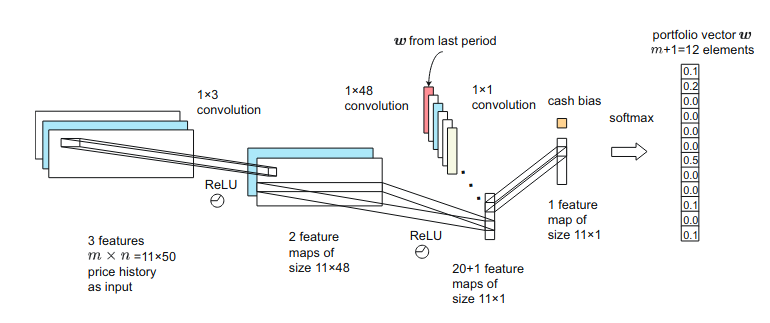

# Deep Financial Portfolio Management

The financial portfolio management problem is to choose an investment strategy given a selection of financial products. In this repository we implement a deep portfolio management algorithm and compare it to several benchmarking strategies. 

There are three branches associated to this repository:

* **main** - Exposition of the basic logic of the training of the reinforcement learning agent.

* **interactive_implementation** - Implements an interactive streamlit app, the app allows users to select a date range and set of stocks. [Give the interactive app a try.](https://mavi-portfolio-management.herokuapp.com/)

## How to

#### Get Data

* portfolio_management/data/get_stock_list.ipynb: Gets list of stock symbols in the SP500 since 2011

* portfolio_management/data/run_get_archive.ipynb: runs get_archive.py to get trading data for symbols collected above from 2011 to 2020 
*Data is stored at portfolio_management/data/archive_data/yf_data.dill*

#### Training / testing

* portfolio_management/dpm_agent_training.ipynb: Trains DeepPortfolio on data from 2011 to 2018. Data from 2019 is used as validation in training.

* portfolio_management/agent_comparison.ipynb: Compares DeepPortfolio against classical agents using 2020 dataset.

## Details about the trading agents

In training and validation simulations each agent is initialized with 1M in a cash account. On each trading day agents are provided with trading data (max, min, opening, closing prices) of d securities from the last 64 days and must select an investment strategy for the following day. The values of the securities at are given by a vector

The first d values are risky securities and the final value represents a risk free investment, a cash account earning 2% interest per year.
 The portfolio at each time step may be expressed as a vector

Each value 

 is the cash value in the corresponding security. We constrain all holdings to be positive. The total value of the portfolio on time step t is

 
The output of each agent (the daily investment strategy) is expressed in terms of the portfolio weight vector 

 
At the close of each trading day each agent refinances their portfolios yeilding an updated weight vector  A trading penalty is assessed proportional to the total volume of the trade

 
The closing value of the porfolio on day t is then 

 

We then allow trading on day t+1 to occur and subsequently recalculate the portfolio positions as follows. The evolution of the porfolio value is calculated as

 
The new portfolio weight vector is 

 
The single step reward is

 
The total reward for the episode is then

  

### Deep Portfolio Management

This agent implements a version of the deep learning trading algorithm introduced in the paper [A Deep Reinforcement Learning Framework for the Financial Portfolio Management Problem](https://arxiv.org/abs/1706.10059).

The architecture of the model is illustrated in the following graphic.

There are 3 convolutional layers with 2 ReLU activation layers and a softmax activation layer. 

The input to the network is a 3 dimensional tensor with dimension (number of stocks) x (time) x (stock features). The features for each stock are the daily opening, closing, high, and low prices. For each trading day the tensor holding the previous 64 trading days is fed into the network. Each stock's data is normalized by the first day's closing value. 

Note there are some minor differences from the paper version to the version implemented here. This version has 4 stock features rather than the 3 illustrated from the paper. The time window in this version is 64 trading periods rather than 50. The risk free security is incorporated into the input dataset rather than appending a cash bias on the last step. Before the softmax step, a weighted average of the current network output and the output from the previous timestep is performed -- rather than appending the previous timestep output to the final layer as in the image above.

#### Training
For the sake of stability, we utilize a mollified reward function

  
A custom training loop is implemented using TensorFlow's GradientTape method and Adam optimizer with negative of the reward as the loss function. To prevent overtraining, a custom call back method breaks training when the performance on the validation set ceases to improve or degrades.

###### __Batching and Subsampling__
Overfitting is a key pitfall in maching learning. Aside from the standard callback discussed above, the additional procedures are utilized. 

Data is gathered from n = 36 stocks over a period of years (2000 - 2020). The 2000 - 2018 data is used for training, the 2019 data is used for validation, and the 2020 data is used for testing. The training data is partitioned into 40 training episodes. 

To prevent overfitting to the behavior of particular stocks for a particular period. 
* For every epoch and episode a random subset of k = 10 stocks is selected for training. 
* Gaussian noise is added to training data for each step in the training process. 

###### __Performance__
In a similar vein, the performance on the validation set is measured by backtesting a random subset of k of n stocks. The average reward over all subsamples is recorded as the agent performance for the purposes of training.

Testing is carried out in a similar manner. On the testing set k stocks are randomly sampled TRIALS = 100 times. For each configuration, each agent backtests their strategy on the sub batch of data. This yeilds paired sample data which can then be used to compare whether one agent outperforms another by used of a t-test.

### CAPM portfolio

The capital asset pricing model agent seeks to build a portfolio maximizing returns while minimizing risk. Returns for each (ith) stock are calculated based on the daily closing values.

  
Here, the matrix K is formed each trading day from the previous T = 64 days of data. The matrix K is then used to calculate the expected returns and covariance matrix for the ensemble of stocks.  

Then, given a risk free return rate r, CAPM then selects the portfolio weight w maximizing

with the constraint that all weights are non-negative. Here, we set the annual risk free return to 2%, so, at an average of 253 trading days  r is defined by the daily risk free return.

### MVP portfolio

The minimum variance portfolio agent builds a portfolio minimizing the risk. With covariance defined as above MVP selects the portfolio w maximizing

with the constraint that all weights are non-negative.